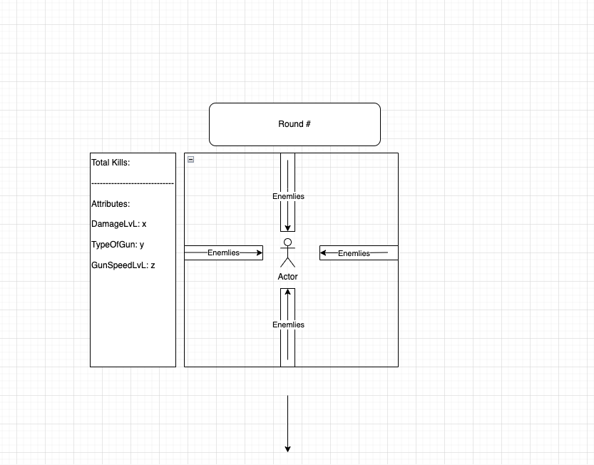

# Project-1-2d-game
SEI621 Project-1: "Last Man Standing"

A classic tower defense style game 

To play Last Man Standing [https://amoreno16003.github.io/last-man-standing/](https://amoreno16003.github.io/last-man-standing/)

## How to Play

Click start on the starting page to begin. The goal of this game is to be quick and elimante the incoming wave of zombies by using your ('UpArrow', 'DownArrow', 'LeftArrow', and 'RightArrow') to shoot at the enemies. You must kill the entire wave of zombies before they kill you. Depending on your performance, you will either be met with a win-screen or a loss-screen.


## How to Install

1. `Fork` and `Clone` this respository to your local machine
2. Open `index.html` in your browser to play or
3. Open the directory in your text editor of choice to view or edit the code

##### Please note: All icons used in this game are free downloads from various sources online
These are not intended for commercial use. This is an educational and personal project.

This project was created as classwork for General Assembly's Software Engineering Immersive. This is project is meant to showcase some simple coding skills using HTML, JavaScript, and CSS. I hope you enjoy the animations, gameplay, and code provided.

## How it Works

Last Man Standing runs within a js/html canvas element, the game is continually being rendered by the `render()` function. This function runs every 60ms and contains all other functions used in order to make this work. 

I used classes to create the userCharacter, the enemies, and the bullets that are being rendered by userInput. Using setInterval/setTimeout allowed me to be able to animate all the characters using different pictures for each frame of each animation. Around 50+ pictures currently. 

```
One of the most difficult parts was getting to render specific things at certain points in the game where it did not interfere with other portions of the game. A couple examples of this are my WalkAnimation() function and my movementhandler() function which are manipulated using certain setIntervals to create the desired result. 
```

#### Unsolved Problems

I currently do not have unsolved problems, but I did run out of time to add everything I wanted such as different enemies(which would require me to edit anothr 50+ pictures for each enemy if I want to have correct animations). Add different waves with a buy phase in between each wave to upgrade the user's character. 

This will be completed in the future once I have more time availible.

#### Working Notes

Time management is the most important skill I have learned when working on this project as I did not have in mind the amount of time that it would take for certain tedious things such as animations.



Cooking recipe fulfillment game - serve food to the customers at different tables. 
Recipes will consist of specifically combined ingredients
Enemy Karen walking around the restaurant floor tries to intercept the server - points will be reset if Karen calls the manager on you. 
The goal: You have a 1 minute timer and need to get as many recipes combined and delivered to customers as possible. 


Phase 1: Start Screen
Welcome to the Game
Click start to begin the game


Phase 2: 
Use you arrow keys to defend yourself from the incoming attackers.


Lose scenario:
Your health runs out if you are not able to kill all the attackers while still having any health. 
You lose health if they hit you, so try to keep them at bay.

Win scenario:
You defeat all zombies while having atleast 1 or more health left.

Phase 3:
You will either be met with a lose screen or a win screen depending on if you win or lose.
